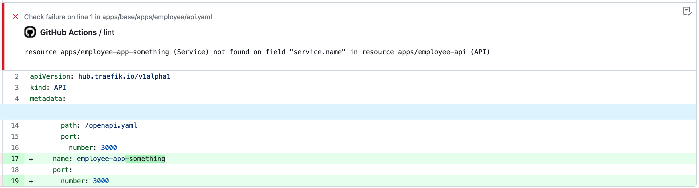
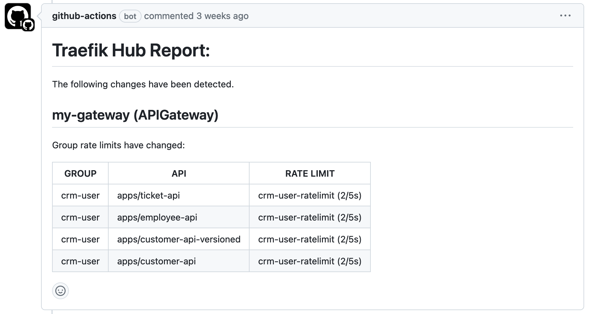

<br/>

<div align="center" style="margin: 30px;">
<a href="https://hub.traefik.io/">
  
</a>
<br />
<br />

<div align="center">
    <a href="https://hub.traefik.io">Log In</a> |
    <a href="https://doc.traefik.io/traefik-hub/">Documentation</a>
</div>
</div>

<br />

<div align="center"><strong>Traefik Hub Static Analyzer GitHub Action</strong>

<br />
<br />
</div>

# About

This GitHub Action performs static analysis on Traefik Hub Custom Resource Definitions (CRD) manifests.  
It allows you to lint the manifests and generate a diff report between commits. 

<!-- Here a link to the upcoming public binary repo -->

> If you run this action in a public repository or if you are a GitHub Enterprise customer,  
you can leverage the SARIF output format to [submit a code scanning artifact](https://docs.github.com/en/code-security/code-scanning/integrating-with-code-scanning/uploading-a-sarif-file-to-github).

## Usage

```yaml
name: Traefik Hub Static Analysis

on:
  push:
    branches:
      - main
  pull_request:
    branches:
      - main

jobs:
  analyze:
    runs-on: ubuntu-latest
    steps:
    - name: Checkout code
      uses: actions/checkout@v4

    - name: Run Traefik Hub Static Analyzer
      uses: traefik/hub-static-analyzer-action:latest
      with:
        # Version of hub-static-analyzer to use.
        # By default, the latest version available will be used.
        version: "latest"

        # Path to the directory containing the manifests to analyze.
        # By default, the current directory will be used.
        path: "path/to/manifests"

        ## Linting options:
        # Enable linting.
        # By default, "false".
        lint: "true"

        # Configure the output format of the linter. One of `unix`, `checkstyle` or `json`.
        # By default, `unix` format will be used.
        lint-format: "unix"

        # Path where to store the linting results. The file will be overwritten if it exists.
        # By default, in "traefik-hub-static-analyzer-lint.out".
        lint-output-file: "/path/to/output.lint.out"

        ## Diff report options:
        # Enable the generation of a diff report.
        # By default, "false".
        diff: "true"

        # Range of commits on which to run the analysis.
        # This could be a strict range: 5f6b21d...cff824e
        # Or use relative references: HEAD~3...HEAD~1
        # Or from a specific commit to HEAD: 5f6b21d
        # By default, diff with unstaged changes.
        diff-range: "HEAD~1"

        # The file will be overwritten if it exists.
        # By default, in "traefik-hub-static-analyzer-diff.out".
        diff-output-file: "/path/to/output.lint.out"
```

## Example

The following example shows a fully configured workflow using this action.

```yaml
name: Traefik Hub Static Analyzer

on:
  pull_request:

jobs:
  lint:
    runs-on: ubuntu-latest
    permissions:
      checks: write
      contents: write
    steps:
      - uses: actions/checkout@v4

      - name: Lint Traefik Hub CRDs with hub-static-analyzer
        uses: traefik/hub-static-analyzer-action@main
        env:
          GH_TOKEN: ${{ secrets.GH_TOKEN }}
        with:
          exclude: "apps/overlays/local/*"
          lint: true
          lint-format: checkstyle
          lint-output-file: ./output.xml

      - name: Annotate code
        if: ${{ !cancelled() }}
        uses: Juuxel/publish-checkstyle-report@v1
        with:
          reports: |
            ./output.xml

  diff:
    runs-on: ubuntu-latest
    permissions:
      checks: write
      contents: write
      pull-requests: write
    steps:
      - uses: actions/checkout@v4
        with:
          fetch-depth: 0

      - name: Lint Traefik Hub CRDs with hub-static-analyzer
        uses: traefik/hub-static-analyzer-action@main
        env:
          GH_TOKEN: ${{ secrets.GH_TOKEN }}
        with:
          diff: true
          diff-range: "origin/${GITHUB_BASE_REF}...origin/${GITHUB_HEAD_REF}"
          diff-output-file: ./output.md

      - name: Prepare report
        shell: bash
        run: |
          set -u

          echo "# Traefik Hub Report" > header.md
          echo "" >> header.md
          echo "The following changes have been detected." >> header.md
          echo "" >> header.md

      - name: Write report
        if: ${{ hashFiles('./output.md') != ''}}
        uses: mshick/add-pr-comment@v2
        with:
          message-path: |
            header.md
            output.md
```

## Scenarios

1. [Lint your manifests and display linting errors in the PR](#lint-your-manifests-and-display-linting-errors-in-the-pr)
2. [Generate a diff report and add the report to the PR](#generate-a-diff-report-and-display-it-in-the-pr)

### Lint your manifests and display linting errors in the PR

This is an example of how to configure this GitHub action to lint your manifests in `checkstyle` format.  
The [Publish Checkstyle Report Action](https://github.com/Juuxel/publish-checkstyle-report) is used to display the `checkstyle` errors
as inline code annotations.

```yaml
name: Traefik Hub Static Analyzer

on:
  pull_request:

jobs:
  lint:
    runs-on: ubuntu-latest
    permissions:
      checks: write
      contents: write
    steps:
      - uses: actions/checkout@v4

      - name: Lint Traefik Hub CRDs with hub-static-analyzer
        uses: traefik/hub-static-analyzer-action@main
        env:
          GH_TOKEN: ${{ secrets.GH_TOKEN }}
        with:
          exclude: "apps/overlays/local/*"
          lint: true
          lint-format: checkstyle
          lint-output-file: ./output.xml

      - name: Annotate code
        if: ${{ !cancelled() }}
        uses: Juuxel/publish-checkstyle-report@v1
        with:
          reports: |
            ./output.xml
```



### Generate a diff report and display it in the PR

This is an example of how to configure this GitHub action to generate a diff report to show the changes between Git commits.  
The [add-pr-comment action](https://github.com/mshick/add-pr-comment "Link to https://github.com/mshick/add-pr-comment") is used to
add the report as a comment to the PR.

```yaml
name: Traefik Hub Static Analyzer

on:
  pull_request:

jobs:
  diff:
    runs-on: ubuntu-latest
    permissions:
      checks: write
      contents: write
      pull-requests: write
    steps:
      - uses: actions/checkout@v4
        with:
          fetch-depth: 0

      - name: Lint Traefik Hub CRDs with hub-static-analyzer
        uses: traefik/hub-static-analyzer-action@main
        env:
          GH_TOKEN: ${{ secrets.GH_TOKEN }}
        with:
          diff: true
          diff-range: "origin/${GITHUB_BASE_REF}...origin/${GITHUB_HEAD_REF}"
          diff-output-file: ./output.md

      - name: Prepare report
        shell: bash
        run: |
          set -u

          echo "# Traefik Hub Report" > header.md
          echo "" >> header.md
          echo "The following changes have been detected." >> header.md
          echo "" >> header.md

      - name: Write report
        if: ${{ hashFiles('./output.md') != ''}}
        uses: mshick/add-pr-comment@v2
        with:
          message-path: |
            header.md
            output.md
```



## License

The content in this repository is licensed under the [Apache 2 License](https://www.apache.org/licenses/LICENSE-2.0 "Link to Apache 2 license").
